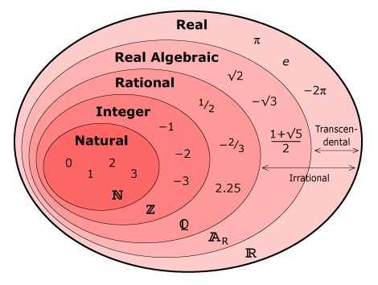

# Definitions
## Entity
An *entity* 


| Term | Everyday Speech | Programming | Philosophy | Mathematics |
|--|--|--|--|--|
| Entity | Something individual, distinct from its properties, attributes, and relations |
| Container | 

| Function |
| 


# Numbers and Sets
We falsely learned that integers ($\mathbb{Z}$) are a subset of rationals ($\mathbb{Q}$), that rationals are a subset of reals ($\mathbb{R}$), and that reals are a subset of complex numbers ($\mathbb{C}$). It's a great simplification, but it's an oversimplification that fails outright in some cases. In fact, sets are an amazing tool, but they have been overused in explaining some structures.

:warning:If you need to call this image wrong to understand what I'm saying, then call it wrong.

:note: <div style="color:red">**This is not an original image, please replace.**</div>
<div style="text-align:center"></div>

## What We Want to Mean by Subset
Since we are going to learn about *Type Theory* and about types more generally, then you should start understanding natural numbers ($\mathbb{N}$), integers, rationals, reals, and any number system, not as being subsets of each other, but as objects that allow us to convert from one-to-another in manner which is faithful (loses no information) in one direction only.

If I were to claim that there is a way to convert from integers ($\mathbb{Z}$) to rational numbers ($\mathbb{Q}$), such that any integer '$n:\mathbb{Z}$' (meaning an value  named 'n' which is of the type of integers) can be made a rational by making the denominator 1 (i.e. $\frac{n}{1}$), then what I'm really saying is that there is exists a function with an input of type integers, and an output of type rationals, for any integer:

$$
f:\mathbb{Z}\to\mathbb{Q}
$$

Where the implementation of this **convertion function** is:

$$
f(n) = \frac{n}{1}
$$

In this, I've given the type of $f$ (its *declaration*) by its input and output (i.e. $\mathbb{Z}\to\mathbb{Q}$), and I've given it an implementation (its *defintiion*) by how it should behave. Without proof, I've asserted that this function $f(n)$ loses no information when it converts, and for now, I'll leave that as an intuition for the concept behind what it means to be *faithful*.

From now on, since we will be working with types, instead of with sets, I'd like any usage of the symbol for subset to take on the meaning of the existence of some faithful function from the input to the output, one that is not necessarily faithful in the opposite direction.

$$
\mathbb{Z}\subset\mathbb{Q}\implies\exists f:\mathbb{Z}\to\mathbb{Q}
$$

Reading this off by breaking it down:

|Expression|Meaning|
|--|--|
| $\mathbb{Z}\subset\mathbb{Q}$ | Integers ($\mathbb{Z}$), being a subset of rationals ($\mathbb{Q}$)
| $\implies$ | "implies that" or in this particular case "can be read that"
| $\exists f:\mathbb{Z}\to\mathbb{Q}$ | there exists a function (I'm naming '$f$') with integer inputs and rational outputs

What that doesn't mean is that there is a function from *any* rational back to an integer.

However, we lose abilities as we change number systems.

## Comparing Behaviors in Number Systems
I want *behavior* here to be both *operations* (like addition and multiplication) and *relations* (like equality or less-than). Keen mathematicians may say that "operations are relations" and they would be correct, but programmers may not use the word that way. Don't worry, we'll get the programmers thinking like this in the end.

As an introduction, consider the question: "Does negation, as an operation, make sense for unsigned integers (naturals)?"

```csharp
uint a = 3;
uint b = -a; // CS0266
```

If you look at the message from CS0266, it says "`Cannot implicitly convert type 'long' to 'uint'. An explicit conversion exists (are you missing a cast?)`".  This message may not make sense at first, but what you are seeing is that C# first attempts to convert the second line to `uint b = -((long)a)`, something the compiler calls *widening*. However, `long` cannot fit inside a `uint`, and so it gives CS0266. Keep in mind, it does this (implicitly), because it thinks you understand that `uint` can't be negative.

Reminder that the inability to convert from `uint` $\to$ `long` is not *faithful*, and that terminology is referred to in the compiler as *narrowing*.

So, you may think then that all operations we can do on naturals ($\mathbb{N}$) we can also do on integers ($\mathbb{Z}$), but you'd be wrong. We cannot do factorial on integers, because there is no definition for factorial on any negative integer.

Going to rationals, we have an even weirder difference. Both naturals and integers allow us to evaluate $0^0$ to $1$. However, we have the problem that, in rationals, this is entirely undefined.

$$
\left( \frac{0}{p} \right) ^ \frac{0}{q}
$$

We have a defined meaning for $0^0$ until moving to rationals. This should also lead you to understand that integers are not just a subset of rationals. We have tricks to resolve this, but **we have to know when our tricks work**. This observation is the key to why we will start using types instead of just sets.

If you have not been through Calculus, you can skip this next statement, but there is a proof that:

$$
\lim_{t\to 0} t^t = 1
$$

However, more generally, this is undefined and undefinable without thoroughly looking inside $f$ and $g$, even if we know that $f(t) \to 0$ and that $g(t) \to 0$:

$$
\lim_{t\to 0} f(t)^{g(t)}
$$

Likewise, division is complicated between these 3 systems:
* In Integers, we have both Euclidean Division and Cyclic Group Division
* In Naturals, we have one division, in which Euclidean and Cyclic Group Division converge
* In Rationals, we also have one division, but it's Rational Division and instead of a quotient-remainder pair, it gives a numerator-denominator pair`

I'll add that, Euclidean Division isn't even well-defined and consistent across implementations (see [Wikipedia:Modulo](https://en.wikipedia.org/wiki/Modulo))

Now, go back to when you were in elementary algebra class and ask yourself, why did they change division on me without explanation?

In C#, we often just ignore the remainder during natural number and integer division, and we don't get rationals to work with, we just get our approximation to reals (float).

```csharp
uint a = 10;
uint b = 6;
uint c = a / b; // --> 1
uint d = a % b; // --> 4
uint e = Math.DivRem(a, b); // --> (1, 4)

// Just don't even ask with regard to (%) on int

float x = 10.0;
float y = 4.0;
float z = x / y; // --> 2.5

```

Finally, consider the Reals ($\mathbb{R}$) vs Complex Numbers ($\mathbb{C}$). We may have been taught that $\mathbb{R}\subset\mathbb{C}$, but we were also taught that we could just convert it like this:

$$
x \mapsto (x, 0)
$$

Such that $(x, 0)$ means the complex number defined by the real-component as $x$, and the imaginary component as $0$. Next question is, what do we lose by converting to Complex Numbers, since addition, subtraction, multiplication, division, exponentiation, etc. all seem to work, and we get more range out of logarithms?

We lose ordering. Imagine the following code:

```csharp
using System.Numerics;

var a = new Complex(2, 3);
var b = new Complex(4, -5);

if (a < b) {  // CS0019
    Console.WriteLine("What have I done?");
}

```

For values of `float` or even `double` the line `if (a < b)` would be not come into question, but since `a` and `b` are both `Complex`, there is no definition for `<` and we get CS0019 telling us that.

This brings us to the major questions of *Type Theory* that we intend to address more rigorously, when is a behavior "compatible"?

Additionally, since you are a programmer, you may also be thinking about bit operations. Our `uint` and `int` has operations like `|` and `&` that are well-defined in C#, but in `float` and `double` they are not. In fact, mathematically, we can create structure that formalizes this too. We have to ignore naturals and integers and instead create structures that I'll call BitNaturals and BitIntegers. However, mathematically, they are sound.

## We Are Interested in Relations that Remain

# There are Multiple Logic Systems
In the same way that there are multiple number systems, there are multiple logic systems, not just Boolean/Classical Logic.


# Equivalence
Substitutability